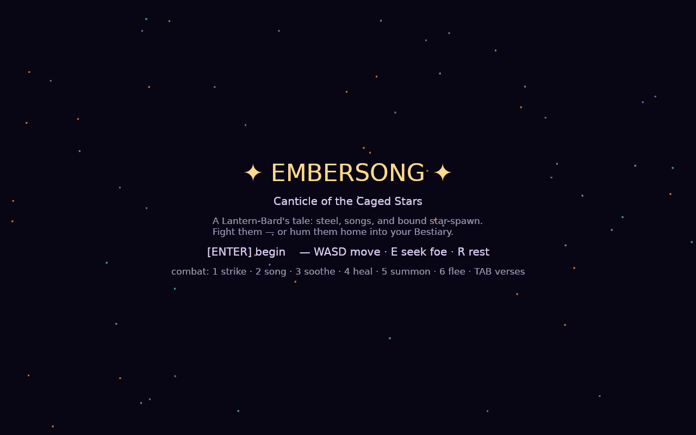
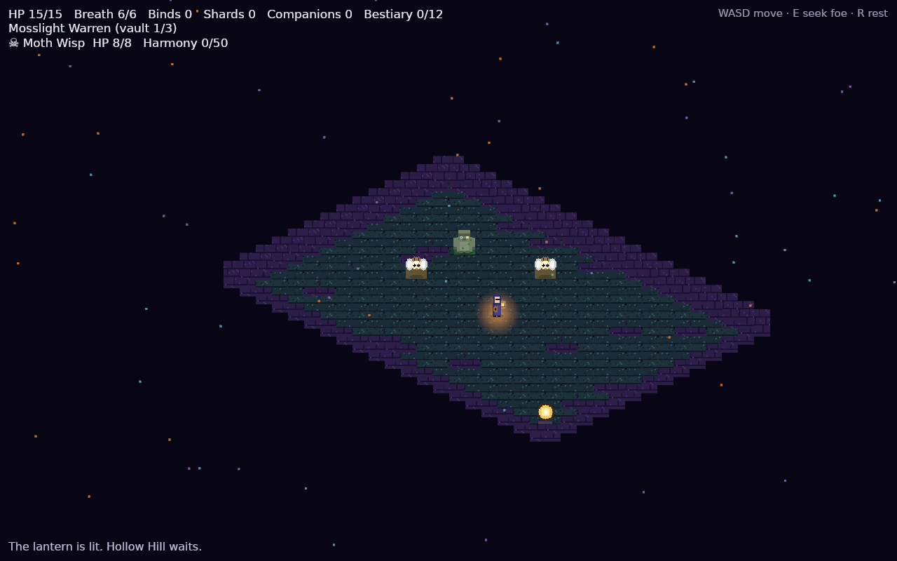
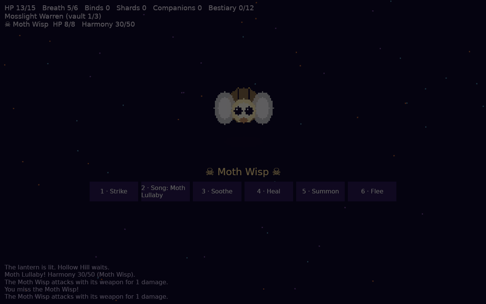

# ✦ Embersong: Canticle of the Caged Stars

A graphical love-letter to
[heroes-and-monsters-game](https://github.com/gruberchris/heroes-and-monsters-game) —
rebuilt as an isometric 2.5D **Bard's-Tale-like dungeon crawl meets Pokémon-like
taming**, written in Rust with its game logic compiled to **WebAssembly and run
sandboxed on the desktop** via wasmtime.

> A century ago the Sky-Choir shattered and its verses fell as living embers.
> Feral verses became monsters. You are a Lantern-Bard of Emberhold Tavern —
> the only one who can fight them with steel, soothe them with songs, and bind
> them into your Bestiary as companions.



## The game

Explore three vaults beneath Hollow Hill from an isometric overworld, then
fight turn-based arena battles:

- **Strike / Verse-Song / Soothe-Tame / Poultice-Heal / Summon / Flee** —
  plus Bard's-Tale verses sung from a Breath pool (Ember Reel, Moth Lullaby,
  Warden's Hymn).
- **Bind, don't just slay** — raise a foe's Harmony and it joins your
  lantern-light. Bound companions fight beside you, guard you, and evolve with
  Star Shards (12-entry Bestiary, elemental type wheel).
- **All five originals return** with their exact quirks: the Goblin goes
  rabid, the Troll regenerates, the Orc triple-slams, the Vampire siphons
  your wounds, and the Hill Giant enrages — halving your blows.
- **Procedural everything** — all creature sprites, tiles, sound effects, and
  bard songs are generated in code. No downloaded assets; the whole game is
  MIT-licensed source.




## Launch it

You need a [Rust toolchain](https://rustup.rs/) (1.78+) and, on Linux, the
usual graphics/audio headers:

```sh
# Linux (Debian/Ubuntu/Pop!_OS)
sudo apt-get install g++ pkg-config libx11-dev libasound2-dev libudev-dev \
    libxkbcommon-dev libwayland-dev
```

```sh
git clone https://github.com/gruberchris/embersong.git
cd embersong

# Build the sandboxed logic module and stage it for the desktop host
rustup target add wasm32-unknown-unknown
cargo build -p embersong-wasm --target wasm32-unknown-unknown --release
cp target/wasm32-unknown-unknown/release/embersong_wasm.wasm \
    crates/embersong-host/assets/core.wasm

# Play
cargo run -p embersong-host --release
```

No display or audio device handy (or just want a quick smoke test)?

```sh
cargo run -p embersong-host -- --headless
```

### Controls

| Where    | Keys |
|----------|------|
| Title    | `Enter` new run · `C` continue (if a save exists) |
| Explore  | `WASD`/arrows move · `E` seek foe · `R` rest & heal |
| Combat   | `1` strike · `2` song · `3` soothe · `4` heal · `5` summon · `6` flee · `Tab` cycle verses |

Progress saves to `embersong-save.json` after every turn.

## How it's built

```text
crates/embersong-core   pure deterministic rules — native AND wasm32-unknown-unknown
crates/embersong-wasm   tiny JSON-in/JSON-out ABI over the core for wasmtime
crates/embersong-host   native Bevy isometric host; embeds core.wasm via wasmtime
crates/embersong-synth  procedural SFX + bard songs (oscillators, no audio files)
crates/embersong-host/src/sprites.rs   procedural pixel-art Canvas (no image files)
crates/xtask            `cargo xtask dist` packaging helper
```

The `.wasm` ships *inside* the desktop binary — no browser involved. If the
guest is missing or fails to load, the host falls back to the identical
linked-in native logic (same code, same seeds).

Determinism is load-bearing here and enforced: every RNG bound is fixed-width
(`rand` samples `usize` ranges with pointer-width math, which diverges between
64-bit hosts and the 32-bit guest), and CI runs a differential check that
executes the WASM guest in lockstep with native code and fails on the first
diverging byte:

```sh
cargo run -p embersong-host -- --headless --native --verify --seed 7 --turns 250
cargo test --workspace
cargo clippy --workspace --all-targets -- -D warnings
```

Desktop targets: Linux x86_64, Windows x86_64, macOS arm64 — see
`.github/workflows/ci.yml` for the release matrix.

## License

MIT — see [LICENSE](LICENSE).
